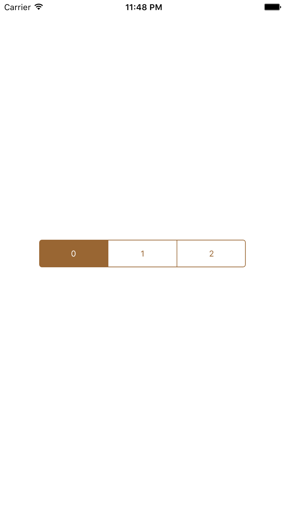

# RBSegmentedControl

[](https://www.bitrise.io/app/e1b3272fa36b8647)
[](https://travis-ci.org/rb-de0/RBSegmentedControl)
[](https://coveralls.io/github/rb-de0/RBSegmentedControl?branch=Feature%2Ftest-coverage)
[](http://cocoapods.org/pods/RBSegmentedControl)
[](http://cocoapods.org/pods/RBSegmentedControl)
[](http://cocoapods.org/pods/RBSegmentedControl)


RBSegmentedControl is a subclass of UIView like UISegmentedControl. You can customize some colors. Also, It supports AutoLayout. So, you can use this on the UIStoryBoards.

## Requirements

- Swift 2.2 / Xcode 7.3
- iOS 8.0 or later (by CocoaPods) / iOS 7 (by copying the source files to your proj directory)

## Installation

RBSegmentedControl is available through [CocoaPods](http://cocoapods.org). To install
it, simply add the following line to your Podfile:

```ruby
source 'https://github.com/CocoaPods/Specs.git'
platform :ios, '8.0'
use_frameworks!

pod 'RBSegmentedControl'
```

## Usage

To run the example project, clone the repo, and run `pod install` from the Example directory first.

Sample of simple handling.

```swift
class ViewController: UIViewController {
    @IBOutlet weak var segmentedControl: RBSegmentedControl!
    
    override func viewDidLoad() {
        super.viewDidLoad()
        segmentedControl.addSegments("0", "1", "2")
        segmentedControl.delegate = self
        
         // Customize Colors
        segmentedControl.borderColor = UIColor.brownColor()
        segmentedControl.segmentBackgroundColor = UIColor.whiteColor()
        segmentedControl.selectedSegmentBackgroundColor = UIColor.brownColor()
        segmentedControl.segmentTextColor = UIColor.brownColor()
        segmentedControl.selectedSegmentTextColor = UIColor.whiteColor()
    }
}

// MARK: - RBSegmentedControlDelegate
extension ViewController: RBSegmentedControlDelegate{
    func rb_segmentedControl(didChangedSelectedIndex index: Int) {
        print(index)
    }
}
```

### Screen Shot
</img>

### Basic Functions

- addSegments ... Adding segment titles by variable-length arguments.
- removeSegments ... Removing segments.

### Basic Property of RBSegmentedControl

- selectedSegmentTextColor
- segmentTextColor
- selectedSegmentBackgroundColor
- segmentBackgroundColor
- borderColor

## Author

[rb_de0](https://twitter.com/rb_de0), rebirth.de0@gmail.com

## License

RBSegmentedControl is available under the MIT license. See the LICENSE file for more info.
